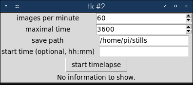
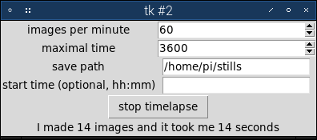
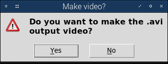

# timelapse-rpi | A tkinter gui for pi camera timelapse

Timelapse-rpi is a tiny, user-friendly interface for making a timelapse with the raspberry pi and his camera.

So let's run it!
## Installation
Open up a terminal and run the following commands:
```
mkdir stills
git clone https://github.com/tarneaux/timelapse-rpi.git
```
## Usage
Open up a terminal and type:
```
cd timelapse-rpi
python3 main.py
```
You should now see a window popping up:



Let's just test it! Press the `start timelapse` button. Now the program will make a 1-hour timelapse with 60 frames captured per minute and 24 fps in the final timelapse. The ouput files will be in the `/home/pi/stills` folder. The ouput video is named `tlcam.avi`.



If you need to stop the timelapse while it is running, just hit that stop button. A dialog will pop-up:



Just answer no and close the window. The timelapse will resume when you reopen the program and hit `start timelapse` again. The ouput video will take all the images in the stills folder, so you can just make a timelapse over a week and stop overnight when there's nothing to see.

If you want to delete old stills to make a new timelapse, open the stills folder, press Ctrl+A and then Del.

## Timelapse settings

If you're not blind you should have noticed the settings in the main window. Let's explain them.

`images per minute`: The number of images to take each minute.
`maximal time`: The duration of the image shotting (unless you press the stop button).
`save path`: The path where to save the images and the ouput video.
`start time (optional, hh:mm)`:  If not empty, the program will start at the specified time. Please use the hh:mm format. Example: entering 09:12 here means the timelapse will start at 12 past 9 in the morning.
